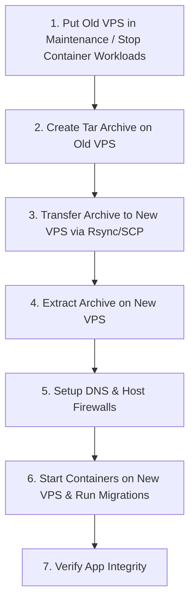

# Hive ERP VPS Deployment & Migration Playbook

This document details the configuration, deployment, and migration processes for running Hive ERP on any clean Linux Virtual Private Server (VPS) using Docker.

---

## Part 1: VPS Preparation & Docker Installation

To ensure maximum performance and security, it is recommended to run Hive on a modern Linux VPS (Ubuntu 24.04 LTS or 22.04 LTS is preferred) with at least **4GB RAM** and **2 CPUs** (due to building assets and running intensive services like Octane, Meilisearch, gotenberg, and rembg).

### 1. System Limits Configuration
Gotenberg, Meilisearch, and database processes can be resource-heavy. Adjust your system limits before launching Docker.

Run the following commands on your clean VPS:

```bash
# Increase virtual memory map limits (essential for search engines and database operations)
sudo sysctl -w vm.max_map_count=262144
echo "vm.max_map_count=262144" | sudo tee -a /etc/sysctl.conf

# Apply changes immediately
sudo sysctl -p
```

### 2. Docker & Docker Compose Installation
Install Docker using the official Docker repository to ensure you receive the latest version:

```bash
# Update the apt package index and install packages to allow apt to use a repository over HTTPS
sudo apt-get update
sudo apt-get install -y ca-certificates curl gnupg

# Add Docker's official GPG key
sudo install -m 0755 -d /etc/apt/keyrings
curl -fsSL https://download.docker.com/linux/ubuntu/gpg | sudo gpg --dearmor -o /etc/apt/keyrings/docker.gpg
sudo chmod a+r /etc/apt/keyrings/docker.gpg

# Set up the repository
echo \
  "deb [arch=$(dpkg --print-architecture) signed-by=/etc/apt/keyrings/docker.gpg] https://download.docker.com/linux/ubuntu \
  $(. /etc/os-release && echo "$VERSION_CODENAME") stable" | \
  sudo tee /etc/apt/sources.list.d/docker.list > /dev/null

# Install Docker Engine, containerd, and Docker Compose
sudo apt-get update
sudo apt-get install -y docker-ce docker-ce-cli containerd.io docker-buildx-plugin docker-compose-plugin

# Verify installation
docker --version
docker compose version

# Configure Docker to start on boot
sudo systemctl enable docker
sudo systemctl start docker

# Add your user to the docker group (optional, prevents needing sudo for docker commands)
sudo usermod -aG docker $USER
newgrp docker
```

---

## Part 2: Project Setup & Environment Configuration

### 1. Copying the Infrastructure Layer
You only need the orchestration/infrastructure repository (`hive-os-infra`) on the VPS, as application images are pulled directly from GHCR (`ghcr.io/mcmike2223/hive-os-backend:latest` and `ghcr.io/mcmike2223/hive-os-frontend:latest`).

Create your application directory and clone/copy the files:
```bash
mkdir -p ~/projects/hive
cd ~/projects/hive

# Clone your infrastructure files if in a repository:
# git clone <your-infra-repo-url> .
```

Ensure your directory contains the following file structure:
- `docker-compose.prod.yml`
- `Caddyfile`
- `Caddyfile.cloudflare`
- `Dockerfile.caddy`
- `.dockerignore`
- `ffmpeg-api/`
- `scripts/deploy-prod.sh`

### 2. Configuring the Environment Variables
Copy `.env.prod-example` to `.env` and fill in the secrets:

```bash
cp .env.prod-example .env
nano .env
```

> [!IMPORTANT]  
> Make sure to update the following variables:
> - `ROOT_DOMAIN`: Set this to your primary domain (e.g., `yourdomain.com`).
> - `SERVER_IP`: Set this to the public IP of your VPS.
> - `DB_PASSWORD`: Set a long, secure password for PostgreSQL.
> - `MEILISEARCH_KEY`: Set a secure master key for search index administration.
> - `AWS_SECRET_ACCESS_KEY` & `SEAWEEDFS_SECRET_KEY`: Set a secure secret key for internal S3 access.

---

## Part 3: Domain Routing & SSL Setup

Hive relies on **Caddy** to route incoming requests to the frontend, backend APIs, websockets (Reverb), and background microservices.

### DNS Setup Checklist
Configure your DNS provider (e.g., Cloudflare, Route53, Namecheap) with the following records:

| Record Type | Name | Target | Purpose |
| :--- | :--- | :--- | :--- |
| **A** | `yourdomain.com` | `YOUR_SERVER_IP` | Root Landing Page / Main portal |
| **A** | `hive` | `YOUR_SERVER_IP` | Frontend App Portal (`hive.yourdomain.com`) |
| **A** | `hive-backend` | `YOUR_SERVER_IP` | REST APIs (`hive-backend.yourdomain.com`) |
| **A** | `hive-ws` | `YOUR_SERVER_IP` | Laravel Reverb WebSockets (`hive-ws.yourdomain.com`) |
| **A** | `hive-queue` | `YOUR_SERVER_IP` | Queue Horizon Dashboard (`hive-queue.yourdomain.com`) |
| **A** | `hive-monitor` | `YOUR_SERVER_IP` | Grafana metrics dashboard (`hive-monitor.yourdomain.com`) |
| **A** | `*.yourdomain.com` | `YOUR_SERVER_IP` | Wildcard entry for dynamically provisioned tenants |

### TLS (SSL) Modes: Select Your Setup

Caddy can operate in two TLS modes depending on how you want to manage wildcard certificates:

#### Option A: On-Demand TLS (Recommended for most VPS platforms)
- **CADDY_TLS_MODE**: `on_demand`
- **How it works**: When a user goes to `tenant1.yourdomain.com` or a custom client-owned domain pointing to your IP, Caddy makes an internal HTTP call to `http://backend:8000/api/internal/caddy/allow-domain?domain=...`. If the backend recognizes the domain as a registered tenant, Caddy automatically fetches and installs a Let's Encrypt / ZeroSSL certificate on the fly.
- **Requirements**: No API tokens needed. However, you must point wildcard DNS (`*`) to the VPS IP.

#### Option B: DNS-01 Cloudflare Challenge (Recommended if proxied behind Cloudflare)
- **CADDY_TLS_MODE**: `cloudflare`
- **CF_API_TOKEN**: Scoped API token from your Cloudflare account with `Zone.DNS` edit permissions.
- **How it works**: Caddy proves domain ownership using the Cloudflare DNS API and pre-fetches a wildcard SSL certificate (`*.yourdomain.com`) automatically.
- **Requirements**: Cloudflare must manage your DNS zone.

---

## Part 4: Production Bootstrap & Tenant Provisioning

### 1. Running the Bootstrapper Script
The `deploy-prod.sh` script automates image fetching, folder permissions configuration, database migrations, asset links, caching configs, and service health checks.

```bash
# Make script executable
chmod +x scripts/deploy-prod.sh

# Run the deployment helper
bash scripts/deploy-prod.sh --root-domain yourdomain.com --server-ip YOUR_SERVER_IP
```

The script will build Caddy and FFmpeg containers, spin up PostgreSQL, Redis, SeaweedFS, and Meilisearch, run core database migrations, and activate Octane (RoadRunner), Horizon, and the Next.js frontend.

### 2. Bootstrapping the Admin Account
Once the containers are running and healthy, bootstrap the central administrative credentials (this skips demo data for a clean production setup):

```bash
docker compose -f docker-compose.prod.yml exec backend php artisan hive:bootstrap-production \
  --email="admin@yourdomain.com" \
  --name="System Administrator"
```
*Note: Write down the generated password output from the command line.*

### 3. Provisioning a Tenant
Create a dedicated workspace for a client or sub-brand.

```bash
docker compose -f docker-compose.prod.yml exec backend php artisan hive:provision-tenant \
  acme \
  "Acme Corporation" \
  --plan=enterprise \
  --business-type=retail \
  --domain=acme.yourdomain.com \
  --admin-name="Acme Admin" \
  --admin-email="admin@acme.yourdomain.com" \
  --admin-password="SecurePassword123!" \
  --module=inventory_control \
  --module=invoice_billing \
  --module=advanced_analytics
```

### 4. Accessing System Monitoring (Prometheus & Grafana)
Hive features an integrated monitoring stack that collects server, container, and proxy-level metrics:
- **Metrics Scraping**: Done automatically via Prometheus scraping targets (`node-exporter`, `cadvisor`, `caddy`, and `prometheus`).
- **Dashboard UI**: Accessible at `https://hive-monitor.yourdomain.com`.
- **Default Credentials**: Username `admin`, Password `admin` (you will be prompted to change this on your first login).
- **Preconfigured Datasource**: Prometheus is auto-provisioned. You do not need to manually configure it.
- **Recommended Dashboard IDs to Import**:
  - `1860`: Node Exporter Full (System Metrics: CPU, Memory, Disk, Network, System Load).
  - `14282`: cAdvisor Docker Containers (Container resource constraints and consumption).

---

## Part 5: Backup & VPS Migration Playbook (Transferring to Another VPS)

All application data, files, search databases, and configurations are stored in the host directory `./storage/`. This local filesystem mounting makes backups and transfers incredibly clean and predictable.

### Data Assets to Transfer
The following folders must be migrated to preserve state:
- `storage/db-data/`: PostgreSQL database files.
- `storage/seaweedfs-data/`: Uploaded files, documents, and media.
- `storage/caddy_data/` and `storage/caddy_config/`: Let's Encrypt certificates (avoids hitting rate limits during migration).
- `storage/search-data/`: Meilisearch index data.
- `storage/prometheus-data/` & `storage/grafana-data/`: Monitoring metrics database and dashboard state storage.
- `.env`: Environment variables and master keys.

---

### Step-by-Step Migration Guide



#### Step 1: Prepare the Old VPS (Target Server A)
Stop the application stack on Server A to write-lock the PostgreSQL database files and prevent file fragmentation:

```bash
cd ~/projects/hive
docker compose -f docker-compose.prod.yml down
```

#### Step 2: Compress and Package the Data
Create an archive containing the `.env` configuration file, Docker deployment files, and all underlying persistent storage volumes:

```bash
tar -czvf hive_backup.tar.gz \
  .env \
  docker-compose.prod.yml \
  Caddyfile \
  Caddyfile.cloudflare \
  Dockerfile.caddy \
  .dockerignore \
  ffmpeg-api/ \
  scripts/ \
  storage/
```

#### Step 3: Copy the Archive to the New VPS (Target Server B)
Transmit the compressed file to the new host using `scp` or `rsync` (faster for large files):

```bash
# Using SCP
scp hive_backup.tar.gz root@NEW_VPS_IP:/root/

# OR using Rsync with progress indicator
rsync -ahz --progress hive_backup.tar.gz root@NEW_VPS_IP:/root/
```

#### Step 4: Extract and Restore on the New VPS
Log into the **New VPS (Server B)** and set up the target directories:

```bash
# Connect to the new VPS
ssh root@NEW_VPS_IP

# Create workspace and extract data
mkdir -p ~/projects/hive
tar -xzvf /root/hive_backup.tar.gz -C ~/projects/hive/
cd ~/projects/hive
```

Verify directory permissions to make sure the containers can read and write to the mount points:
```bash
chmod -R 775 storage
```

#### Step 5: Update IP Configuration
If the domain is staying the same, but the IP has changed, edit `.env` to update `SERVER_IP` to the new VPS public IP address:

```bash
nano .env
# Edit: SERVER_IP=NEW_VPS_IP_HERE
```

#### Step 6: Install Docker on the New VPS
*(If you haven't already, run the script from **Part 1** to install Docker and Docker Compose).*

#### Step 7: Launch the Application Stack on the New VPS
Start the containers using the helper script. It will read the migrated databases and media automatically:

```bash
bash scripts/deploy-prod.sh --root-domain yourdomain.com --server-ip NEW_VPS_IP
```

#### Step 8: Update DNS Records
Point your DNS A-records (`yourdomain.com`, `*.yourdomain.com`, etc.) to `NEW_VPS_IP`. 

> [!NOTE]  
> If you migrated your `storage/caddy_data/` directory, Caddy will reuse the existing SSL certificates immediately, preventing any downtime or certificate issuance delays while DNS propagates.

#### Step 9: Post-Migration Check
Verify that all services are up and functional:

```bash
# Verify container statuses
docker compose -f docker-compose.prod.yml ps

# Force index updates on the new search engine (optional)
docker compose -f docker-compose.prod.yml exec backend php artisan scout:import-all
```

---

## Part 6: Docker & VPS Cleanup Guide

Over time, Docker builds, logs, and temporary package files can consume significant disk space. Follow this guide to safely clean your local dev machine or production VPS.

### 1. Docker Cleanup Commands

Use these commands to reclaim disk space from unused Docker resources:

| Command | Description | Safety Level |
| :--- | :--- | :--- |
| `docker system df` | Display Docker disk space usage. | 🟢 Safe (Informational) |
| `docker container prune -f` | Remove all stopped containers. | 🟡 Medium (Destroys stopped instances) |
| `docker image prune -a -f` | Remove all unused images (not just dangling ones). | 🟡 Medium (Redownloads if needed later) |
| `docker volume prune -f` | Remove all unused local volumes. | 🔴 Caution (Can delete database state if stopped) |
| `docker builder prune -a -f` | Clean the Docker build cache (reclaims huge space). | 🟢 Safe (Rebuilds take longer) |
| `docker system prune -a --volumes -f` | Deep clean everything (stopped containers, unused networks, images, cache, and volumes). | 🔴 Danger (Destroys all non-running data) |

#### Quick Clean Script (Recommended for routine VPS maintenance)
Run this to clean cache and old images without touching active database volumes:
```bash
docker builder prune -af
docker image prune -af
```

---

### 2. Resetting the Hive Environment (Fresh Install)

For a fresh production environment reset (e.g., wiping all data, cache, rebuilding, and migration/fresh seeding), an automated reset script is provided under `scripts/reset-prod.sh`.

This script automates:
1. Fetching the latest codebase from `main`.
2. Validating the Redis PECL compilation guardrail.
3. Forcing `predis` configuration in `.env`.
4. Creating a timestamped backup of current database, search, and object storage folders before wiping.
5. Stopping all application services and wiping storage volumes / runtime caches.
6. Rebuilding Docker containers cleanly.
7. Starting dependencies and waiting for database/Redis/search/object storage healthchecks.
8. Bootstrapping Laravel databases and fresh seeding central and tenant language tables.
9. Launching queue workers, WebSockets (Reverb), frontend, and Caddy.
10. Re-indexing Meilisearch.

#### Running the Reset Script

Run the following command in the project root:
```bash
# Make the script executable
chmod +x scripts/reset-prod.sh

# Run the reset procedure
bash scripts/reset-prod.sh
```

> [!CAUTION]
> Running this script will completely wipe all databases, uploaded files, search indexes, and cache data. It attempts to create a tarball backup in `/var/www/hive-reset-backups/` before wiping, but this script is destructive. Do not run it on an active production environment without absolute certainty.

---

### 3. General VPS Linux Housekeeping
If your VPS storage is filling up outside of Docker:

#### Vacuum System Logs (Journald)
System journals can grow to gigabytes over time. Limit them to a specific size or age:
```bash
# Check current size of journals
journalctl --disk-usage

# Keep only logs from the last 3 days
sudo journalctl --vacuum-time=3d

# Or keep only up to 100MB of log data
sudo journalctl --vacuum-size=100M
```

#### Package Manager Clean
Remove cached packages and dependencies no longer needed:
```bash
sudo apt-get autoremove -y
sudo apt-get clean
```

#### Find Large Directories
To locate what is consuming disk space on the host VPS filesystem:
```bash
sudo du -ah /home | sort -rh | head -n 20
```

---

## Part 7: Troubleshooting

### 1. Database Connection Failures
If the backend throws a "Connection refused" or Postgres authentication error:
- Ensure the `DB_PASSWORD` in your `.env` matches the password used when the Postgres database volume was initially created.
- Check the database health check status: `docker compose ps db`.
- Look at database logs: `docker compose logs db`.

### 2. Disk Space Constraints
During Docker updates, old images remain on disk. If the deploy script aborts due to low storage space, clean the disk using:
```bash
docker system prune -a --volumes -f
```

### 3. Websocket / Chat connection drops
Ensure that `NEXT_PUBLIC_REVERB_HOST` points to `hive-ws.yourdomain.com` and that port `443` (HTTPS) is open in the server firewall.
If using Cloudflare proxy, make sure Cloudflare WebSockets are toggled **ON** in the Cloudflare Dashboard under **Network** -> **WebSockets**.

---

## Part 8: Local Development Reset & Optimization

When developing locally or troubleshooting sync/translation issues, you may need to reset the database, re-seed translations, import search indexes, and clear caches.

### 1. Complete Database Reset & Seeding
To completely wipe the local database and run all migrations with fresh seeds:
```bash
# Wipe database, run migrations, and seed standard tables
docker compose exec backend php artisan migrate:fresh --seed
```

### 2. Language & Translation Seeding
After a database reset, seed and sync localized translations:
```bash
# Seed the central language tables
docker compose exec backend php artisan db:seed --class='Modules\Core\Database\Seeders\LanguageSeeder'

# Seed the tenant-level language tables
docker compose exec backend php artisan tenants:seed --class='Modules\Core\Database\Seeders\LanguageSeeder'

# Synchronize central and tenant localizations
docker compose exec backend php artisan localization:sync
docker compose exec backend php artisan tenants:run localization:sync
```
> [!NOTE]  
> In Windows PowerShell/WSL environments, if class names fail to resolve, escape the backslashes like so: `--class=Modules\\Core\\Database\\Seeders\\LanguageSeeder`.

### 3. Search Engine Indexing
Re-index all models to Meilisearch:
```bash
# Import all database records into Meilisearch
docker compose exec backend php artisan scout:import-all
```

### 4. Cache Clearing & Server Reloads
Clear all stale application, route, config, and view caches to apply changes instantly:
```bash
# Clear all application optimization caches
docker compose exec backend php artisan optimize:clear
docker compose exec backend php artisan config:clear
docker compose exec backend php artisan route:clear
docker compose exec backend php artisan view:clear

# Reload Octane (RoadRunner/Swoole) to apply backend code updates
docker compose exec backend php artisan octane:reload
```

### 5. Frontend & Queue Worker Restarts
Restart key service runtimes to pick up updated environment variables and configurations:
```bash
# Restart Next.js dev server container
docker compose restart frontend

# Terminate active Horizon workers to force a clean reload of job handlers
docker compose exec backend php artisan horizon:terminate
docker compose exec backend php artisan horizon:clear
```
